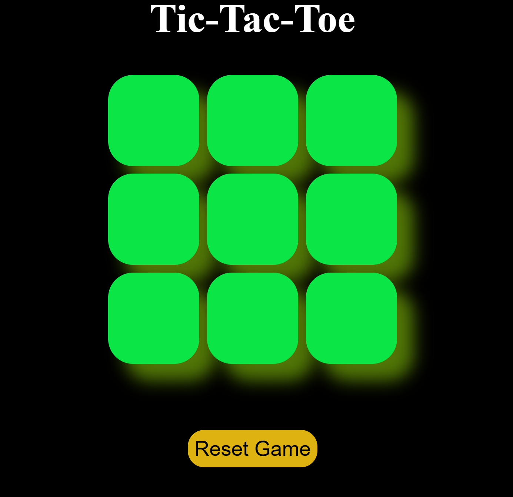

# 🎮 Tic Tac Toe Game

A **simple, responsive Tic Tac Toe game** built using **HTML, CSS, and JavaScript**. This turn-based game allows a single player to take alternating turns as **X** and **O**, with full win/draw detection and reset functionality.

---

## 🧠 Features

- 🧍 Single-player (turn-based)
- ❌⭕ Markers for each turn (X or O)
- 🏆 Win condition check after every move
- 😮 Draw detection when all cells are filled
- 🔄 Reset / New Game buttons
- 📱 Fully responsive layout for phones and desktops
- ✨ Clean UI with smooth visuals

---

## 📸 Screenshot



---
🎮 [Play the Game Online](https://hasibulansari.github.io/tic-tac-toe-game/)


## 🛠️ Technologies Used

- **HTML** for structure  
- **CSS** for styling and responsiveness  
- **JavaScript** for game logic and interactivity  

---

## 🚀 Getting Started

### Option 1: Live Preview

Just open the `index.html` file in your browser.

### Option 2: Clone and Run Locally

```bash
git clone https://github.com/HasibulAnsari/tic-tac-toe.git
cd tic-tac-toe
open index.html
